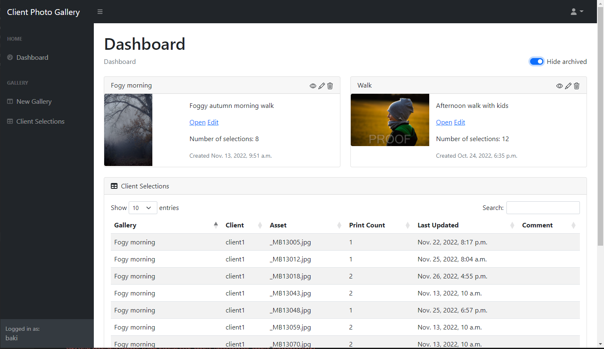
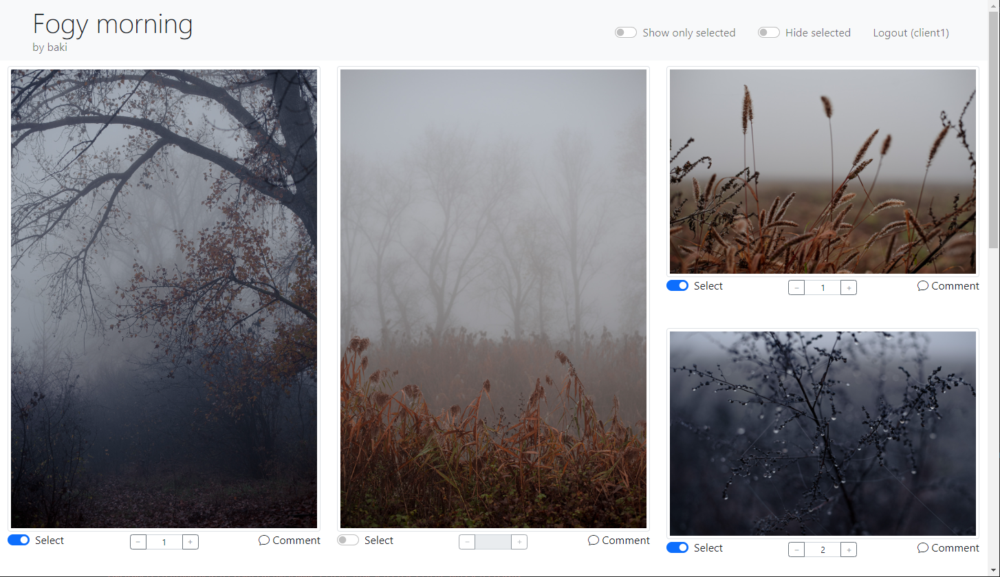
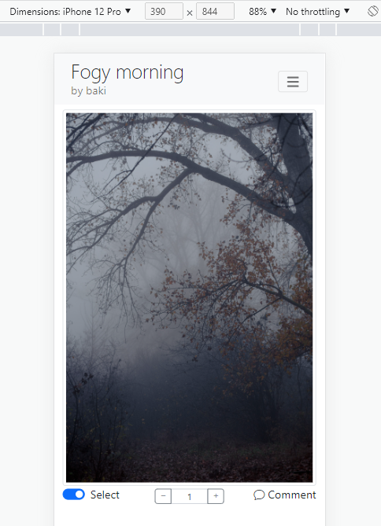

# CS50w final Capstone project

This is my final project for CS50w course. Client Photo Gallery is web application for photographers to share their work with clients who will be able to select and comment on images they want for final processing.

## Distinctiveness and Complexity
This project satisfies distinctiveness and complexity from other projects because of following:

- It is based on personal requirement for a tool to help share photos with clients
- Uses Django Class Based Views (CBV) as well as Functional Based Views (FBV)
- There are several models to implement the required functionality
- Care was taken for pages to reload as little as possible due to amount of high resolution pictures
- JavaScript is used for lot of front-end functionality
- JavaScript Fetch API with JSON is used for communication between front-end and back-end
- Use of modern, open source libraries like jQuery, DataTables, Bootstrap, Masonry

## Features
### Dashboard
Where photographer can create galleries, manage pictures and see how many clients have made selections

### Client view
Separate view for the clients where they can view galleries shared with them, select pictures for final processing and add additional comments to the pictures they selected.

## Responsive
Web application is mobile friendly with responsive design

## File content description
Description of contents of files created for this project (excluding standard Django files like models, views and urls.)

- forms.py - definition for CBV Forms used by the project
- storage.py - customized file handling function for Django storage class
- templatetags\app_filters.py - various filters used in the templates
- templates\clientphotogallery - Django template  files, see below for description

**Client view templates**

- clientgalleryauth.html - gallery view authentication page where client enters gallery password if set
- clientgalleryview.html - main client view for given gallery
- clientlanding.html - simple view where client can provide gallery id to be taken to specific gallery view

**Photographer view templates**

- index.html - landing page view for Client Photo Gallery with product feature promo and contact info.
- layout.html - main layout for photographer admin view with top navbar and left sidebar nav and footer.
- dashboard.html - this is main dashboard for photographers where they can see all their galleries, links to view, edit and delete, and summary table of client selections.
- gallerycreate.html - template for creating new gallery - add title, description, load files, set password.
- galleryedit.html - template for editing gallery - edit title, description, add additional pictures, update password.
- gallerydetail.html - template for viewing full gallery details where photographer can remove pictures, view pictures, and see comments on each picture.
- gallerydelete.html - simple view just for confirming gallery deleting.
- clientselections.html - client selections view with different groupings for asset
- base.html - base layout for photographer login/register views.
- login.html - photographer login page view.
- register.html - photographer register page view.

## Technologies
Web application is build using Django, HTML, CSS and JavaScript and can be deployed using provided docker file that builds container with python, nginx and gunicorn.

- Django 4.1.1 (https://www.djangoproject.com/)
- Gunicorn 20.1.0 (https://gunicorn.org/)
- Nginx (https://nginx.org/)
- Boostrap (https://getbootstrap.com/)
- SimpleLightbox (https://simplelightbox.com/)
- DataTables (https://datatables.net/)
- Masonry (https://masonry.desandro.com/)

## How to run
* clone this repo
* create `.env` file in the root folder of repo and define following environment variables (ensue .env has unix line endings):
        
        DEBUG=1
        DJANGO_SECRET_KEY=some string of random characters
        DJANGO_ALLOWED_HOSTS=localhost,127.0.0.1,[::1],*

* if you want to deploy to docker containers, ensure docker is installed and run:

       sudo docker-compose up -d --build

* if you want to run standalone Django, ensure you have python 3.x installed and run following:
       
  Linux:

       python3 -m venv env
       . env/bin/activate
       pip install --upgrade pip
       pip install django
       set -a && source .env && set +a
       python capstone/manage.py runserver 0.0.0.0:5000

  Windows:

       .\python3 -m venv env
       .\env\Scripts\Activate.ps1
       pip install --upgrade pip
       pip install django
       .\load_env.ps1   
       python .\capstone\manage.py runserver 127.0.0.1:7000 

## Unit tests

There are few simple tests written that test functionality of some models and views. To execute tests run following:

1. Modify `settings.py` and set the `SECRET_KEY` to some value, for example:

          #SECRET_KEY = os.environ.get("DJANGO_SECRET_KEY")
          SECRET_KEY = 'testkey'

2. Execute unit tests from the folder where the `manage.py` is:

          python.exe .\manage.py test

## To-Do

- Implement comments
- Redesign index page - this was taken from Bootstrap free samples and was just quickly modified to suite this final project
- Add more unit tests

